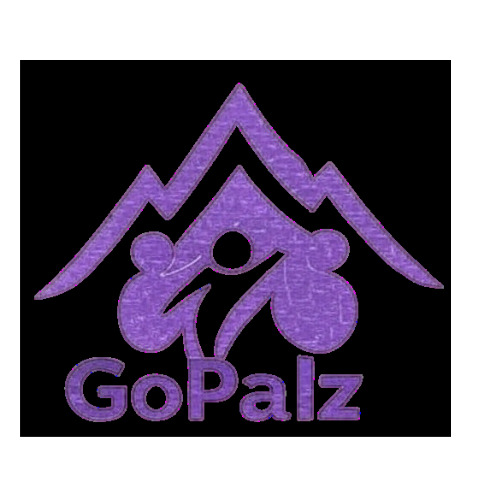
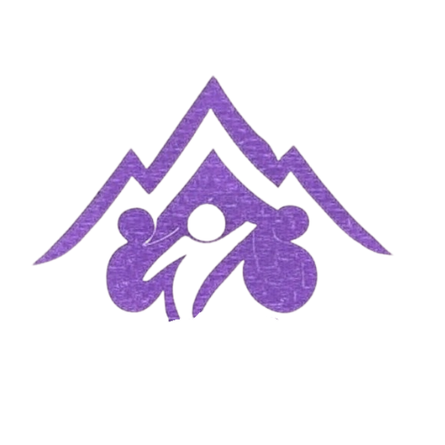

# GoPalz - Adventure Companion Platform for Cameroon

<div align="center">
  
</div>

## 🌄 Transforming Adventure Tourism in Cameroon

In the heart of West Africa lies Cameroon – "Africa in Miniature" – a country blessed with diverse landscapes from pristine beaches to majestic mountains, lush rainforests to expansive savannas. Despite this natural wealth, adventure tourism remains fragmented, with travelers struggling to find reliable companions and locals missing opportunities to showcase their homeland.

**GoPalz** is not just an app – it's a movement born from a deep passion for adventure and a vision to transform Cameroon's tourism landscape. We're building a vibrant community where adventure seekers connect with local guides, creating authentic experiences while fostering economic opportunities for communities across Bamenda, Douala, Limbe, and beyond.

<div align="center">
  
  <p><em>The GoPalz homepage showcasing our adventure discovery platform</em></p>
</div>

Our platform addresses the fundamental challenges facing adventure tourism in Cameroon:

- **Trust Gap**: Through blockchain-verified identities and reputation systems, we create confidence between strangers
- **Discovery Challenge**: We surface hidden gems and authentic experiences that traditional tourism overlooks
- **Community Building**: We connect adventure enthusiasts with shared interests and complementary skills
- **Economic Empowerment**: We enable local guides to showcase their expertise and earn sustainable income

<div align="center">
  
  <p><em>The user dashboard displaying upcoming adventures and personalized recommendations</em></p>
</div>


## 🌍 Project Vision

GoPalz aims to transform adventure tourism in Cameroon by:

- Connecting like-minded adventure enthusiasts across Cameroon's diverse regions
- Providing a trusted platform for planning and discovering authentic local experiences
- Building a reputation system through completed adventures that rewards both travelers and guides
- Leveraging blockchain technology for trust verification and digital identity protection
- Creating a community-governed adventure ecosystem where participants shape the platform's future


<div align="center">
  
 alt="GoPalz Signup" width="80%"/>
  <p><em>Our secure signup process - the first step to joining the GoPalz adventure community</em></p>
</div>

## 🚀 Technology Stack


### Current Implementation
- **Frontend**: React.js, Next.js, Bootstrap, TailwindCSS - creating a responsive, modern interface with our distinctive Electric Purple (#8A2BE2) and Gold (#FFD700) color scheme
- **Backend**: Firebase (Authentication, Firestore, Storage) - providing secure, scalable infrastructure for user data and content
- **Maps & Location**: Leaflet.js - enabling precise location-based adventure planning and discovery
- **Forms & Validation**: Formik, Yup - ensuring data integrity and smooth user experience

### Planned/In Progress
- **Blockchain**: Cardano for trust verification and NFT badges - chosen for its energy efficiency and strong academic foundation
- **Identity Verification**: Atala PRISM for decentralized identity - giving users control over their personal data while ensuring trust
- **Interoperability**: Hyperledger Firefly for enterprise blockchain integration - enabling partnerships with tourism businesses and government entities

## ✨ Features

### Currently Implemented

- **User Authentication**: Secure email/password, Google, and Apple sign-in with Firebase Authentication
- **User Profiles**: Personalized profiles with adventure preferences and experience levels
- **Trip Discovery**: Advanced search with filters for activity type, location, date range, and difficulty
- **Trip Creation**: Intuitive trip planning with location mapping, participant limits, and media uploads
- **Location Services**: Interactive maps for trip planning and discovery using Leaflet.js
- **Real-time Updates**: Live notifications and trip status changes through Firebase

<div align="center">
  
</div>

### Roadmap Features

- **NFT Achievement Badges**: Earn digital collectibles for completed adventures that prove your experience
- **Trust Verification**: Blockchain-powered identity verification using Atala PRISM
- **Reputation System**: Build credibility through successful adventures with verifiable records
- **Community Governance**: Badge holders gain voting rights on platform decisions and future features
- **Mobile App**: Native mobile experience for Android and iOS with offline capabilities
- **Local Business Integration**: Partnerships with local tourism providers and adventure equipment rentals

## 🛠️ Getting Started

### Prerequisites
- Node.js (v16+)
- npm or yarn
- Firebase account (for development)

### Installation

1. Clone the repository
   ```bash
   git clone https://github.com/yourusername/gopalz.git
   cd gopalz
   ```

2. Install dependencies
   ```bash
   npm install
   # or
   yarn install
   ```

3. Set up environment variables
   Create a `.env.local` file in the root directory with your Firebase configuration:
   ```
   NEXT_PUBLIC_FIREBASE_API_KEY=your_api_key
   NEXT_PUBLIC_FIREBASE_AUTH_DOMAIN=your_auth_domain
   NEXT_PUBLIC_FIREBASE_PROJECT_ID=your_project_id
   NEXT_PUBLIC_FIREBASE_STORAGE_BUCKET=your_storage_bucket
   NEXT_PUBLIC_FIREBASE_MESSAGING_SENDER_ID=your_messaging_sender_id
   NEXT_PUBLIC_FIREBASE_APP_ID=your_app_id
   ```

4. Run the development server
   ```bash
   npm run dev
   # or
   yarn dev
   ```

5. Open [http://localhost:3000](http://localhost:3000) in your browser

## 🤝 How to Contribute

We welcome contributions from developers, designers, and adventure enthusiasts across the globe! GoPalz is more than a platform - it's a community effort to transform adventure tourism in Cameroon.

### 1. Set Up Your Development Environment

```bash
# Fork the repository first on GitHub

# Clone your fork locally
git clone https://github.com/yourusername/gopalz.git
cd gopalz

# Install dependencies
npm install

# Set up your .env.local file with Firebase credentials
# (Contact the team for development credentials if needed)

# Start the development server
npm run dev
```

### 2. Priority Areas for Contribution

We're currently focusing on these key areas:

- **Phase 1 Enhancements**:
  - Improving trip discovery algorithms
  - Enhancing user profile features
  - Optimizing mobile responsiveness
  
- **Phase 2 Development**:
  - Cardano blockchain integration
  - NFT badge system implementation
  - Atala PRISM identity verification

### 3. Development Workflow

1. **Find or Create an Issue**: Check our [Issues](https://github.com/yourusername/gopalz/issues) or create a new one
2. **Branch Strategy**: 
   - Feature branches: `feature/your-feature-name`
   - Bug fixes: `fix/issue-description`
   - Documentation: `docs/what-youre-documenting`
3. **Coding Standards**:
   - Follow our ESLint configuration
   - Use TypeScript for type safety
   - Follow component structure in existing files
4. **Testing**: Write tests for new features using Jest and React Testing Library
5. **Pull Request Process**:
   - Provide clear descriptions of your changes
   - Reference the issue number
   - Include screenshots for UI changes
   - Ensure CI checks pass

### 4. Contribution Ideas by Expertise

#### For Developers:
- Implement real-time trip updates and notifications
- Create the NFT badge system using Cardano
- Optimize Firebase queries for better performance
- Implement offline capabilities for rural areas with poor connectivity

#### For Designers:
- Enhance UI with Cameroon-inspired design elements
- Improve user flow for trip creation and discovery
- Design NFT badge visuals for different achievement types
- Create promotional materials for local communities

#### For Local Experts:
- Contribute location data for hidden gems in Cameroon
- Provide cultural context for different regions
- Test the platform in various locations across the country
- Help translate the interface into local languages

## 📱 Current Project Status

GoPalz is currently in **Phase 1: Local Launch**, focusing on:
- Core platform functionality
- User authentication and profiles
- Trip planning and discovery features

**Phase 2: Trust Enhancement** is in planning, which will introduce:
- Cardano wallet integration
- NFT badge system
- Reputation scoring
- Enhanced identity verification

## 📄 License

This project is licensed under the MIT License - see the [LICENSE](LICENSE) file for details.

## 🙏 Acknowledgements

- The adventure community in Cameroon for inspiration
- [Next.js](https://nextjs.org) for the React framework
- [Firebase](https://firebase.google.com) for backend services
- [Cardano](https://cardano.org) for blockchain infrastructure
- All contributors who have helped shape this project
